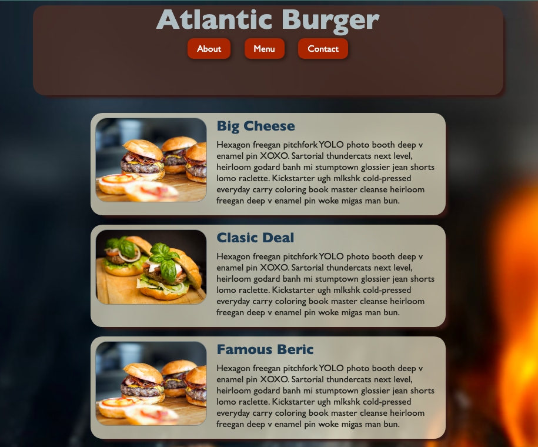

# Restaurant Page JS

> This project consist on build a webpage using Webpack, ES6 Classes and Module Pattern.

## Built With

- JS
- Webpack
- ES6
- CSS

## Live Demo

[Live Demo Link](https://livedemo.com)

## Getting Started

- Download the repo con your computer.
- Drag and drop the index.html file on the dist folder.
- Enjoy.

## Authors

👤 **David Elí**

- Github: [@davitomix](https://github.com/davitomix)
- Twitter: [@davitomix007](https://twitter.com/davitomix007)
- Linkedin: [David Garcia](https://www.linkedin.com/in/davideligarcia/)

## 🤝 Contributing

Contributions, issues and feature requests are welcome!

Feel free to check the [issues page](issues/).

## Show your support

Give a ⭐️ if you like this project!

## Acknowledgments

- Hat tip to anyone whose code was used
- Inspiration
- etc

## 📝 License

This project is [MIT](lic.url) licensed.
